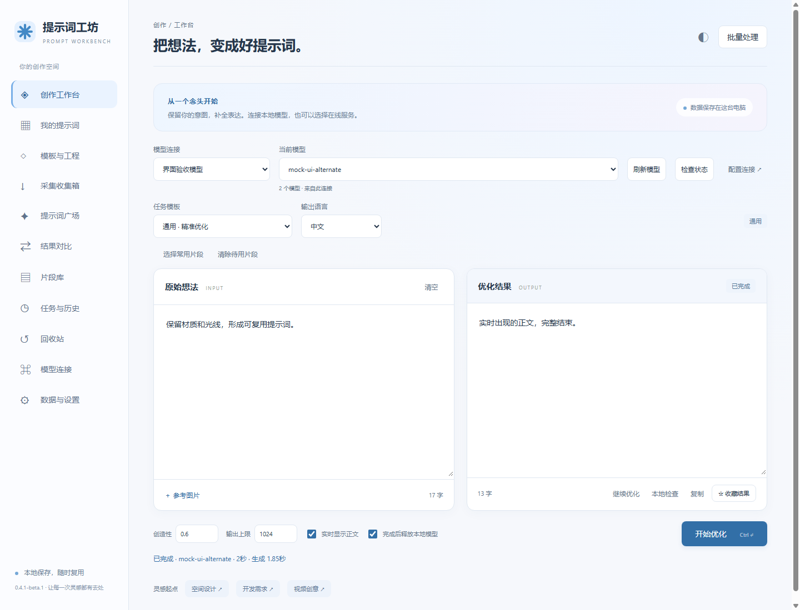
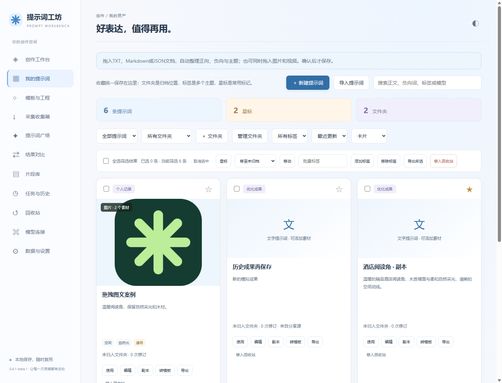
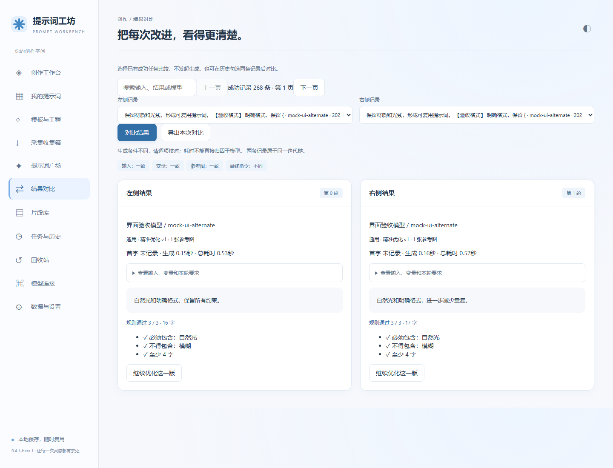

# 提示词工坊 / Prompt Workbench

本地优先的中文提示词工作台：保存、整理、优化和复用提示词，连接你选择的本地模型或在线服务。Windows优先，Node.js原生模块与SQLite，生产运行无第三方npm依赖。

> 0.4.1-beta.1 公开预览。模型生成仍需人工核对事实和约束。不是云服务或Electron安装包，不支持直接暴露公网。

## 界面预览

以下为隔离演示环境中的真实界面截图，使用模拟连接、模拟结果和示例提示词；不含私人数据，生成内容与耗时不代表真实模型效果。点击图片可查看原图。

**创作工作台** — 选择连接与模板，保留原始想法，编辑和收藏结果。

展开查看：提示词素材管理与结果对比

**我的提示词** — 用文件夹、标签和星标整理收藏，支持文本与图片、视频素材。

**结果对比** — 并排查看已有结果、生成条件与本地规则检查；对比操作不发起生成。

## 开始使用

1. 安装官方[Node.js 24 LTS](https://nodejs.org/en/download)，确认终端node --version至少为24。推荐24，不使用已结束支持的25。
2. 下载[Release](https://github.com/vinwjin/prompt-workbench/releases)源码包并解压到可写目录，或git clone本仓库。
3. Windows双击“启动提示词工坊.bat”，或在项目目录运行npm start。无需npm install。
4. 打开http://127.0.0.1:18765/。首次没有私人连接或数据，在“模型连接”填写你的服务与实际模型ID。
5. 关闭使用“数据与设置→保存并关闭”，或“关闭提示词工坊.bat”；释放未确认时按反馈处理，不强杀其他服务。

不需要管理员权限。启动器不安装Node、下载模型、修改防火墙或自动安装快捷方式。需要时手动执行npm run shortcuts，已有不属于本项目的同名入口不会被覆盖。

## 能做什么

- 优化、扩写、翻译、图片可见事实描述、H3场景提示词；H3是文本模板，不生成视频。
- 带变量与版本的模板、片段组合、多轮优化、结果并排对比、本地确定性规则检查。
- 提示词收藏、文件夹、标签、星标、正负提示词、素材附件、回收站和修订历史。
- TXT/Markdown/JSON/基础YAML确认导入，图片视频收藏展示，任务历史与串行批量文本。
- 来源目录、手动同步和文件导入；原始来源、作者、许可保留。37项登记不等于37项可自动同步。

## 模型和密钥

支持OpenAI兼容、Anthropic Messages、Gemini及Ollama协议。厂家地址是可编辑预设，不保证每个账号/模型的参数兼容。在线地址必须HTTPS。在线生成只在用户提交任务后发生，可能计费；失败不自动重复请求。模型列表检查不发送提示词。

本地Ollama和llama-server只使用已安装服务/模型，不自动下载。托管模型只释放本应用取得使用权的模型；已有外部模型不会自动接管。自定义兼容连接仅调用接口，不承诺控制服务生命周期。

Windows API密钥通过DPAPI当前用户加密，不回传浏览器或包含在业务导出中。Linux/macOS的在线密钥保护与托管进程未受支持，不以明文降级。自有提示词、素材、备份和日志并未因此全盘加密。

Router无需本机专用目录。可连接已运行服务；如要由工作台管理，显式设置PW_ROUTER_MANAGER为可信脚本的绝对路径。脚本接口须接受-Action start/stop及启动时-NoBrowser。PW_ROUTER_URL指定该脚本实际管理的服务根地址，默认http://127.0.0.1:18180；PW_ROUTER_INI可选，只读取得模型列表。未配置则不执行管理脚本，不自动创建本机连接。

## 数据、限制和迁移

数据保存在data/。PW_DATA_DIR可指定其他目录，PW_PORT可指定端口，启动与关闭脚本使用相同环境变量。环境变量由启动终端继承。源码和模型目录保持分开。

备份、JSON合并恢复、DPAPI跨用户限制及完整升级步骤见[数据与恢复](docs/DATA.md)。缓存可重读，但私人附件为保证旧备份恢复会保留，磁盘占用需关注。日志无无限容量保证。

本地来源获取会访问原站/CDN并暴露你的网络IP；生成会把选定输入和参考图发给选定服务。不存在后台上传全部个人资料的功能。备份仍含私人正文与路径，不应提交Issue。

图片任务每张2MB、每任务4张；收藏图片20MB、视频100MB，每条8项/200MB。视频能否播放取决于浏览器编码。大JSON导入使用内存缓冲，上传超时30秒，超大迁移推荐停机复制完整data；不承诺任意规模。

## 来源与许可

项目自有代码采用[MIT](LICENSE)。外部提示词、媒体、模型和服务条款不由MIT统一覆盖。本仓库不附外部词库/图片缓存。未知权限来源在公开版只提供原站入口和有权文件的确认导入；非商业来源遵守对应内容限制。见[来源台账](docs/SOURCES.md)与[第三方说明](THIRD_PARTY_NOTICES.md)。

## 开发与贡献

~~~powershell
npm run check
npm test
npm run check:release
npm run test:smoke
npm run test:ui
~~~

UI检查需要Chrome/Edge，使用临时数据、模拟模型与模拟来源，证据默认写work/ui-evidence。真实模型/计费生成不在CI运行。Linux检查通过也不能替代Windows支持验证。

[贡献流程](CONTRIBUTING.md) · [安全报告](SECURITY.md) · [维护与发布](docs/MAINTENANCE.md) · [当前状态](docs/STATUS.md) · [版本记录](CHANGELOG.md)
